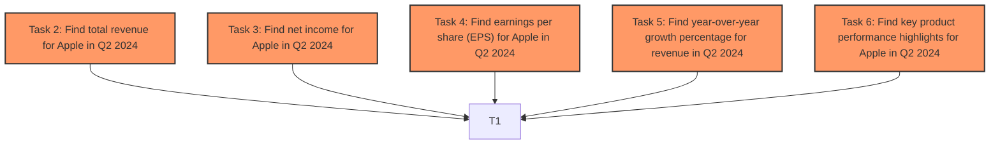

# Task Planning and Execution System with LLMs and Topological Sort

This project demonstrates a proof-of-concept task planning and execution system leveraging OpenAI's Functions and topological sorting for managing task dependencies. It allows you to define complex tasks as a series of smaller, dependent subtasks, and then executes them in the correct order, respecting dependencies and parallelism limits.

> This work is inspired by the [Task Planning and Execution System with OpenAI Functions and Topological Sort](https://github.com/jxnl/task-planner) project. Credits: Jan Philipp Harries / @jpdus


## Table of Contents

- [Features](#features)
- [Getting Started](#getting-started)
  - [Prerequisites](#prerequisites)
  - [Installation](#installation)
  - [Environment Setup](#environment-setup)
- [Usage](#usage)
  - [Basic Task Planning and Execution](#basic-task-planning-and-execution)
  - [Defining Tasks Manually](#defining-tasks-manually)
  - [Adding Tasks Dynamically](#adding-tasks-dynamically)
  - [Controlling Parallelism](#controlling-parallelism)
  - [Task Priorities](#task-priorities)
  - [Visualizing Task Plans with Mermaid](#visualizing-task-plans-with-mermaid)
- [Code Structure](#code-structure)
  - [Key Classes](#key-classes)
  - [Task Types and Statuses](#task-types-and-statuses)
- [Extending and Customizing](#extending-and-customizing)
  - [Implementing Task Execution Logic](#implementing-task-execution-logic)
  - [Task Completion Notifications](#task-completion-notifications)
- [Error Handling](#error-handling)
- [Potential Improvements and Future Work](#potential-improvements-and-future-work)
- [Contributing](#contributing)
- [License](#license)
- [Author](#author)

## Features

- **AI-Powered Task Planning:** Utilizes OpenAI's GPT models (specifically `gpt-4o`) via the `instructor` library to automatically decompose complex questions into structured task plans.
- **Topological Sort for Dependency Management:** Ensures tasks are executed in the correct order by resolving task dependencies using topological sorting. This guarantees that subtasks are completed before their parent tasks.
- **Asynchronous Task Execution:** Employs `asyncio` for efficient concurrent task execution, maximizing throughput and reducing overall execution time.
- **Parallelism Control:** Limits the number of concurrently running tasks using a semaphore, preventing resource overload and allowing for controlled execution.
- **Task Status Tracking:** Tracks the status of each task (`PENDING`, `IN_PROGRESS`, `COMPLETED`), providing real-time insights into the execution flow.
- **Task Priorities:** Supports task prioritization, allowing you to specify the order in which tasks are executed when multiple tasks are ready. Higher priority tasks are executed first.
- **Task Types:** Categorizes tasks into different types (`DATA_RETRIEVAL`, `COMPARISON`, `CALCULATION`, `TEMPORAL_REASONING`) to potentially guide execution logic (currently placeholder logic).
- **Dynamic Task Addition:** Demonstrates the ability to add new tasks to the plan during execution based on the results of previous tasks, enabling more flexible and adaptive workflows.
- **Mermaid Graph Visualization:** Generates Mermaid diagrams to visualize the task plan and its execution status, making it easy to understand task dependencies and progress.
- **Error Handling:** Includes basic circular dependency detection to prevent infinite loops in task execution.
- **Extensible Task Execution:** Provides a clear structure for developers to implement custom logic for different task types within the `Task` class.
- **Task Completion Notifications:**  Offers an optional callback mechanism to be notified when tasks are completed, enabling integration with other systems or logging.

## Getting Started

Follow these steps to get started with the task planning and execution system.

### Prerequisites

- **Python 3.8+:**  Ensure you have Python 3.8 or a later version installed.
- **OpenAI API Key:** You will need an active OpenAI API key to use the GPT models for task planning. You can obtain one from the [OpenAI Platform](https://platform.openai.com/).

### Installation

1. **Clone the repository (if applicable):**

   ```bash
   git clone <repository_url>
   cd <repository_directory>
   ```

2. **Install required Python packages:**

   ```bash
   pip install openai instructor-llm pydantic loguru toposort
   ```

   **Explanation of packages:**
   - `openai`:  The official OpenAI Python library for interacting with the OpenAI API.
   - `instructor-llm`:  Enhances the OpenAI client with Pydantic model integration, making it easy to work with structured data and function calling.
   - `pydantic`:  For data validation and settings management using Python type hints.
   - `loguru`:  For user-friendly and configurable logging.
   - `toposort`: (Although implicitly used within the code and not a direct dependency in `pip install` command in the provided code snippet, it is good to mention it as it is conceptually important for topological sort logic). This library is used for topological sorting of task dependencies.

### Environment Setup

1. **Set your OpenAI API Key:**

   You need to set your OpenAI API key as an environment variable named `OPENAI_API_KEY`.  The easiest way to do this is to export it in your terminal before running the script:

   ```bash
   export OPENAI_API_KEY="YOUR_OPENAI_API_KEY"
   ```

   Replace `"YOUR_OPENAI_API_KEY"` with your actual OpenAI API key.

## Usage

Here are examples of how to use the task planning and execution system.

### Basic Task Planning and Execution

The most straightforward way to use the system is to use the `task_planner` function to generate a task plan from a user query and then execute it.

```python
import asyncio
import time
from rich import print
from datetime import datetime
from your_script_name import task_planner, TaskPlan # Replace your_script_name

async def main():
    start_time_planner = time.time()
    plan = task_planner("If my future wife has the same first name as the 15th first lady of the United States' mother and her surname is the same as the second assassinated president's mother's maiden name, what is my future wife's name?")

    print(plan.model_dump_json(indent=2))
    end_time_planner = time.time()
    print(f"Time taken for planning: {end_time_planner - start_time_planner:.2f} seconds")

    print('Executing Tasks')
    start_time_execution = time.time()
    task_results = await plan.execute() # Execute the plan
    end_time_execution = time.time()
    print(f'Tasks executed in {end_time_execution - start_time_execution:.2f} seconds')
    print("Task Results:")
    for task_id, result in task_results.items():
        print(f"  Task {task_id}: {result.result}")

if __name__ == "__main__":
    asyncio.run(main())
```

**Explanation:**

1. **`task_planner(question)`:** This function takes a user question as input and uses OpenAI to generate a `TaskPlan` object, which contains a list of `Task` objects representing the decomposed tasks and their dependencies.
2. **`plan.model_dump_json(indent=2)`:**  Prints the generated task plan in a formatted JSON structure for inspection.
3. **`await plan.execute()`:**  Executes the task plan asynchronously. It returns a dictionary of `TaskResult` objects, keyed by task ID, containing the results of each executed task.
4. **Printing Results:** The code then iterates through the `task_results` and prints the result of each task.

### Defining Tasks Manually

You can also create `TaskPlan` objects and `Task` objects manually to define your task plans directly in code:

```python
from your_script_name import TaskPlan, Task, TaskType, log_task_completion # Replace your_script_name
import asyncio
import time
from rich import print

async def main():
    task_plan = TaskPlan(
        task_graph=[
            Task(id=1, task="Main task: Calculate final result", subtasks=[2, 3], task_type=TaskType.CALCULATION),
            Task(id=2, task="Subtask 1: Get value A", subtasks=[], task_type=TaskType.DATA_RETRIEVAL),
            Task(id=3, task="Subtask 2: Get value B", subtasks=[], task_type=TaskType.DATA_RETRIEVAL),
        ],
        parallelism_limit=2,
        _notify_on_completion=log_task_completion # Optional notification callback
    )

    print(task_plan.model_dump_json(indent=2))
    print(task_plan.generate_mermaid_graph()) # Visualize the initial plan

    start_time_execution = time.time()
    task_results = await task_plan.execute()
    end_time_execution = time.time()
    print(f'Tasks executed in {end_time_execution - start_time_execution:.2f} seconds')

    print("Task Results:")
    for task_id, result in task_results.items():
        print(f"  Task {task_id}: {result.result}")

if __name__ == "__main__":
    asyncio.run(main())
```

**Explanation:**

- We manually create a `TaskPlan` object and define a list of `Task` objects within its `task_graph`.
- Each `Task` object requires:
    - `id`: A unique integer ID for the task.
    - `task`: A string describing the task.
    - `subtasks`: A list of IDs of subtasks that must be completed before this task can be executed.
    - `task_type`: The type of task (e.g., `DATA_RETRIEVAL`, `CALCULATION`).

### Adding Tasks Dynamically

The system supports adding new tasks to the plan during execution. This is demonstrated in the `aexecute` method of the `Task` class.  If a task's execution logic determines that new subtasks are needed, it can add them to the `TaskPlan`.

In the provided code, the placeholder logic `if "Add new task" in result.result:` in the `aexecute` method shows how you might trigger the addition of new tasks. You would replace this with your own logic based on the task's outcome.

```python
# ... inside the Task.aexecute method ...
        if "Add new task" in result.result:  # Placeholder logic to add new tasks
            new_task_id = max(tasks.keys()) + 1
            new_task = Task(
                id=new_task_id,
                task=f"Newly added subtask of task {self.id}",
                subtasks=[],
                priority=1,
                task_type=TaskType.DATA_RETRIEVAL,
                status=TaskStatus.PENDING,
            )
            self.add_task(new_task, parent_task_id=self.id) # Add new task to the plan
            tasks[new_task_id] = new_task
# ...
```

### Controlling Parallelism

The `parallelism_limit` attribute of the `TaskPlan` class controls the maximum number of tasks that can be executed concurrently. You can set this value when creating a `TaskPlan` object:

```python
task_plan = TaskPlan(
    task_graph=[...],
    parallelism_limit=2 # Limit to 2 concurrent tasks
)
```

Adjusting this value can help optimize performance based on your system's resources and the nature of your tasks.

### Task Priorities

Each `Task` object has a `priority` attribute (defaulting to 1). Tasks with higher priority values are executed first when multiple tasks are ready to run.

```python
Task(id=2, task="High priority subtask", subtasks=[], priority=2, task_type=TaskType.DATA_RETRIEVAL) # Higher priority
Task(id=3, task="Low priority subtask", subtasks=[], priority=1, task_type=TaskType.DATA_RETRIEVAL)  # Default priority
```

### Visualizing Task Plans with Mermaid

The `TaskPlan` class includes a `generate_mermaid_graph()` method that generates a Mermaid diagram representing the task plan and its execution status. You can use this output to visualize the plan in Mermaid-compatible viewers (online editors, Markdown extensions, etc.).

```python
plan = task_planner("...")
mermaid_graph = plan.generate_mermaid_graph()
print(mermaid_graph) # Print the Mermaid code

# Example Mermaid Output (rendered):

# ```mermaid
# graph TD
#     T2["Task 2: Find total revenue for Apple in Q2 2024"]:::pending
#     T3["Task 3: Find net income for Apple in Q2 2024"]:::pending
#     T4["Task 4: Find earnings per share (EPS) for Apple in Q2 2024"]:::pending
#     T5["Task 5: Find year-over-year growth percentage for revenue in Q2 2024"]:::pending
#     T6["Task 6: Find key product performance highlights for Apple in Q2 2024"]:::pending
#     T2 --> T1
#     T3 --> T1
#     T4 --> T1
#     T5 --> T1
#     T6 --> T1
#     classDef completed fill:#9f6,stroke:#333,stroke-width:2px;
#     classDef in_progress fill:#ff9,stroke:#333,stroke-width:2px;
#     classDef pending fill:#f96,stroke:#333,stroke-width:2px;
# ```


The node colors in the Mermaid graph dynamically reflect the task status:

- **Green:** `COMPLETED`
- **Yellow:** `IN_PROGRESS`
- **Orange:** `PENDING`

## Code Structure

Here's a breakdown of the main components of the code.

### Key Classes

- **`Task (pydantic.BaseModel)`:**
    - Represents a single task in the task plan.
    - Attributes:
        - `id (int)`: Unique identifier for the task.
        - `task (str)`: Text description of the task.
        - `subtasks (List[int])`: List of IDs of subtasks that must be completed first.
        - `priority (int)`: Priority of the task (higher value = higher priority).
        - `task_type (TaskType)`: Type of the task (e.g., `DATA_RETRIEVAL`).
        - `status (TaskStatus)`: Current status of the task (`PENDING`, `IN_PROGRESS`, `COMPLETED`).
    - Methods:
        - `aexecute(with_results: TaskResults) -> TaskResult`:  Asynchronous method to execute the task. **Developers should implement the actual task logic in this method.**

- **`TaskPlan (pydantic.BaseModel)`:**
    - Represents the entire task plan, containing a list of tasks and managing their execution.
    - Attributes:
        - `task_graph (List[Task])`: List of `Task` objects in the plan.
        - `parallelism_limit (int)`: Maximum number of tasks to execute concurrently.
        - `_notify_on_completion (Optional[Callable[[Task], None]])`: Optional callback function to be called when a task completes.
    - Methods:
        - `execute() -> Dict[int, TaskResult]`: Asynchronously executes the task plan.
        - `add_task(new_task: Task, parent_task_id: int = None)`: Adds a new task to the plan, optionally making it a subtask of an existing task.
        - `generate_mermaid_graph() -> str`: Generates a Mermaid diagram of the task plan.
        - `_get_execution_order() -> List[int]`:  Uses topological sort to determine the correct task execution order based on dependencies.
        - `_identify_circular_dependencies(dep_graph: Dict[int, Set[int]]) -> List[List[int]]`: Detects circular dependencies in the task graph.

### Task Types and Statuses

- **`TaskType (StrEnum)`:**
    - Enumerates the possible types of tasks: `DATA_RETRIEVAL`, `COMPARISON`, `CALCULATION`, `TEMPORAL_REASONING`. You can extend this enum to include more task types relevant to your application.

- **`TaskStatus (StrEnum)`:**
    - Enumerates the possible statuses of a task: `PENDING`, `IN_PROGRESS`, `COMPLETED`.

- **`TaskResult (pydantic.BaseModel)`:**
    - Represents the result of executing a task.
    - Attributes:
        - `task_id (int)`: ID of the task.
        - `result (str)`: The result of the task execution (currently a string placeholder).

- **`TaskResults (pydantic.BaseModel)`:**
    - A container for a list of `TaskResult` objects, used to pass subtask results to parent tasks.

## Extending and Customizing

This proof of concept provides a foundation for building more sophisticated task planning and execution systems. Here are some ways you can extend and customize it.

### Implementing Task Execution Logic

The core of task execution happens in the `aexecute` method of the `Task` class. Currently, this method contains placeholder logic based on `task_type`. To make this system useful for real-world applications, you need to **replace this placeholder logic with actual code that performs the desired actions for each `TaskType`**.

For example:

- For `TaskType.DATA_RETRIEVAL`, you might implement logic to query a database, call an API, or scrape a website to retrieve data.
- For `TaskType.COMPARISON`, you would compare results from subtasks and make decisions based on the comparison.
- For `TaskType.CALCULATION`, you would perform calculations using the results of subtasks.

**Example of Custom `aexecute` Method (Illustrative):**

```python
class Task(BaseModel):
    # ... (other attributes) ...

    async def aexecute(self, with_results: TaskResults) -> TaskResult:
        logger.info(f"Executing task {self.id}: {self.task}")
        await asyncio.sleep(1) # Simulate task execution time

        if self.task_type == TaskType.DATA_RETRIEVAL:
            # Example: Simulate data retrieval
            result_data = f"Data retrieved for task {self.id}: {self.task}"
            final_result = f"Data Retrieval Task {self.id} - Result: {result_data}"

        elif self.task_type == TaskType.CALCULATION:
            # Example: Simulate calculation based on subtask results
            value_a = 0
            value_b = 0
            for res in with_results.results:
                if res.task_id == 2: # Assuming task 2 is "Get value A"
                    try:
                        value_a = int(res.result.split(":")[-1].strip()) # Extract value from result string
                    except:
                        value_a = 0
                elif res.task_id == 3: # Assuming task 3 is "Get value B"
                    try:
                        value_b = int(res.result.split(":")[-1].strip()) # Extract value from result string
                    except:
                        value_b = 0

            calculation_result = value_a + value_b
            final_result = f"Calculation Task {self.id} - Result: {calculation_result}"

        else: # Default placeholder
            reasoning_output = f"Executing task `{self.task}`. Aggregating results from subtasks: "
            subtask_details = []
            for result in with_results.results:
                subtask_details.append(f"(Subtask {result.task_id}: {result.result})")
            reasoning_output += ", ".join(subtask_details)
            final_result = f"{reasoning_output} -> Final output for task {self.id}"

        logger.info(f"Task {self.id} executed at {datetime.now()}")
        logger.info(final_result)
        return TaskResult(task_id=self.id, result=final_result)
```

**Important:**  When implementing real task logic, consider:

- **Error Handling:** Implement robust error handling within `aexecute` to catch exceptions and manage task failures gracefully.
- **Data Passing:** Design a clear way to pass data between tasks, potentially using `TaskResult` to carry structured data instead of just strings.
- **External Integrations:** Integrate with external tools, databases, APIs, and services as needed for your specific tasks.

### Task Completion Notifications

The `TaskPlan` class supports an optional `_notify_on_completion` callback function. You can provide a function to be executed whenever a task is completed. This can be useful for logging, monitoring, or triggering other actions upon task completion.

To use task completion notifications:

1. **Define a callback function:**

   ```python
   def my_task_completion_callback(task: Task):
       print(f"Task {task.id} - '{task.task}' COMPLETED at {datetime.now()}!")
       # Perform other actions like logging to a database, sending notifications, etc.
   ```

2. **Pass the callback function to the `TaskPlan` constructor:**

   ```python
   task_plan = TaskPlan(
       task_graph=[...],
       parallelism_limit=2,
       _notify_on_completion=my_task_completion_callback # Set the callback
   )
   ```

## Error Handling

- **Circular Dependency Detection:** The `TaskPlan` class includes logic to detect circular dependencies in the task graph. If circular dependencies are found, a `ValueError` is raised, preventing execution and indicating an issue in the task plan definition.
- **Task Execution Errors:**  Error handling within the `aexecute` method (as discussed in [Implementing Task Execution Logic](#implementing-task-execution-logic)) is crucial for robust task execution. You should implement error handling to catch exceptions during task execution and potentially retry tasks, log errors, or gracefully handle failures.

## Potential Improvements and Future Work

- **More Sophisticated Task Execution Logic:**  Enhance the `aexecute` method to support more complex task types and execution strategies.
- **Integration with External Tools and APIs:** Expand the system to seamlessly integrate with various external tools, databases, and APIs for real-world task automation.
- **Advanced Error Handling and Recovery:** Implement more advanced error handling and recovery mechanisms, such as task retries, circuit breakers, and fallback strategies.
- **Task Monitoring and Visualization:** Develop more comprehensive task monitoring and visualization tools to track task progress, performance, and identify bottlenecks.
- **Dynamic Task Planning Refinement:** Explore techniques for the system to dynamically refine task plans during execution based on intermediate results and changing conditions.
- **User Interface:** Create a user interface (command-line or web-based) to make it easier to define, manage, and monitor task plans.
- **Scalability and Performance Optimizations:**  Investigate scalability and performance optimizations for handling very large and complex task plans.

## Contributing

Contributions to this project are welcome! If you have ideas for improvements, bug fixes, or new features, please feel free to:

1. **Fork the repository.**
2. **Create a branch for your contribution.**
3. **Implement your changes.**
4. **Submit a pull request.**

Please ensure your contributions are well-documented and tested.

## License

[Choose a license for your project, e.g., MIT License]

```
MIT License

Copyright (c) [Year] [Your Name]

Permission is hereby granted, free of charge, to any person obtaining a copy
of this software and associated documentation files (the "Software"), to deal
in the Software without restriction, including without limitation the rights
to use, copy, modify, merge, publish, distribute, sublicense, and/or sell
copies of the Software, and to permit persons to whom the Software is
furnished to do so, subject to the following conditions:

The above copyright notice and this permission notice shall be included in all
copies or substantial portions of the Software.

THE SOFTWARE IS PROVIDED "AS IS", WITHOUT WARRANTY OF ANY KIND, EXPRESS OR
IMPLIED, INCLUDING BUT NOT LIMITED TO THE WARRANTIES OF MERCHANTABILITY,
FITNESS FOR A PARTICULAR PURPOSE AND NONINFRINGEMENT. IN NO EVENT SHALL THE
AUTHORS OR COPYRIGHT HOLDERS BE LIABLE FOR ANY CLAIM, DAMAGES OR OTHER
LIABILITY, WHETHER IN AN ACTION OF CONTRACT, TORT OR OTHERWISE, ARISING FROM,
OUT OF OR IN CONNECTION WITH THE SOFTWARE OR THE USE OR OTHER DEALINGS IN THE
SOFTWARE.
```

For questions or feedback, please feel free to reach out.

